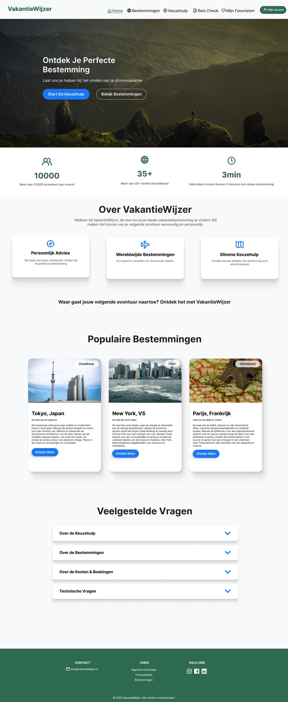

# VakantieWijzer 🌍✈️

## Inhoudsopgave
- [1. Inleiding](#1-inleiding)
  - [Toegankelijkheid & Authenticatie](#toegankelijkheid--authenticatie)
  - [Belangrijkste functionaliteiten](#belangrijkste-functionaliteiten)
- [2. Screenshot](#2-screenshot)
- [3. Benodigdheden](#3-benodigdheden)
- [4. De applicatie draaien](#4-de-applicatie-draaien)
  - [Stap 1: Repository klonen](#stap-1-repository-klonen)
  - [Stap 2: Dependencies installeren](#stap-2-dependencies-installeren)
  - [Stap 3: Configuratie](#stap-3-configuratie)
  - [Stap 4: Applicatie starten](#stap-4-applicatie-starten)
- [5. Overige commando's](#5-overige-commandos)
- [6. Browser Ondersteuning](#6-browser-ondersteuning)
- [7. Doeleinden](#7-doeleinden)

## 1. Inleiding
VakantieWijzer is een interactieve webapplicatie die je helpt bij het vinden van je ideale vakantiebestemming. Door middel van een keuzehulp, uitgebreide zoekfunctie en persoonlijke voorkeuren krijg je gepersonaliseerde reisaanbevelingen.

### Toegankelijkheid & Authenticatie
- De homepagina is toegankelijk voor alle bezoekers
- Overige pagina's zijn alleen toegankelijk voor ingelogde gebruikers
- Account vereisten:
  - **Gebruikersnaam**: minimaal 6 karakters
  - **Wachtwoord**: minimaal 8 karakters, waarvan:
    - Minimaal 1 hoofdletter
    - Minimaal 1 cijfer
  - **Akkoord gaan met de algemene voorwaarden**

### Belangrijkste functionaliteiten
- **Keuzehulp**: Ontdek je perfecte bestemming via een korte vragenlijst
- **Bestemmingen verkennen**: Zoek en filter door verschillende vakantiebestemmingen
- **Persoonlijk account**: Sla je favoriete bestemmingen op
- **Reis checklist**: Handige paklijsten voor verschillende type reizen
- **Real-time weer info**: Actuele weersinformatie van bestemmingen
- **Lokale gerechten**: Lokale gerechten voor elke bestemming
- **Top activiteiten**: Aanbevolen activiteiten voor elke bestemming

## 2. Screenshot


## 3. Benodigdheden
| Software | Minimale versie |
|----------|-----------------|
| Node.js  | 14.0.0         |
| npm      | 6.0.0          |
| Git      | Laatste versie |

### Vereiste API keys
| API         | Doel                   |
|-------------|------------------------|
| OpenWeather | Weersinformatie       |
| Pixabay     | Afbeeldingen          |
| Spoonacular | Lokale gerechten      |
| OpenTripMap | Activiteiten          |
| OpenCage    | Geolocatie            |

## 4. De applicatie draaien

### Stap 1: Repository klonen
```bash
git clone https://github.com/siyar09/vakantiewijzer.git
cd vakantiewijzer
```

### Stap 2: Dependencies installeren
```bash
npm install
```

### Stap 3: Configuratie

#### Voor beoordelaars
Voor testdoeleinden staan de API keys in de `.env` beschikbaar voor de beoordelaars.

#### Voor overige gebruikers
1. Maak een `.env` bestand aan in de root map (op dezelfde hoogte als de .gitignore en package.json).
2. Vraag API keys aan bij de volgende services:
   - [OpenWeather](https://openweathermap.org/api)
   - [Pixabay](https://pixabay.com/api/docs/)
   - [Spoonacular](https://spoonacular.com/food-api)
   - [OpenTripMap](https://dev.opentripmap.org/product)
   - [OpenCage](https://opencagedata.com/api)

3. Vul het `.env` bestand met je eigen API keys:
```env
VITE_APP_WEATHER_API_KEY=jouw_openweather_api_key
VITE_APP_PIXABAY_API_KEY=jouw_pixabay_api_key
VITE_APP_SPOONACULAR_API_KEY=jouw_spoonacular_api_key
VITE_APP_OPENTRIP_API_KEY=jouw_opentrip_api_key
VITE_APP_OPENCAGE_API_KEY=jouw_opencage_api_key
```

### Stap 4: Applicatie starten
```bash
npm run dev
```

## 5. Overige commando's
| Commando | Beschrijving |
|----------|-------------|
| `npm run build` | Bouwt de applicatie voor productie |
| `npm run preview` | Start lokale server voor productie build |
| `npm run lint` | Voert ESLint uit voor code kwaliteit |
| `npm run test` | Start de test suite |
| `npm run format` | Formatteert code volgens Prettier |

## 6. Browser Ondersteuning
✅ Chrome (laatste versie)  
✅ Firefox (laatste versie)  
✅ Safari (laatste versie)  
✅ Edge (laatste versie)

## 7. Doeleinden
De applicatie is alleen bedoeld als schoolproject en is niet bedoeld voor gebruik in de echte wereld.

